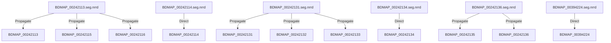

# Production GPU Evaluation Architecture: JHU Radiologist-Corrected Set

**Location:** `02_Projects/mp-factory`  
**Core Components:**
- 📄 Python Script: [`code/evaluate_jhu_radiologist_gpu.py`](file:///Users/chrissong/research_su26/02_Projects/mp-factory/code/evaluate_jhu_radiologist_gpu.py)
- ⚙️ Slurm SBATCH Script: [`code/run_jhu_radiologist_eval_gpu.sbatch`](file:///Users/chrissong/research_su26/02_Projects/mp-factory/code/run_jhu_radiologist_eval_gpu.sbatch)
- 📊 Output Summary CSV: `results/jhu_radiologist_gpu_audit_summary.csv`

---

## 1. Overview & Architectural Intent

This production pipeline evaluates deep learning 3D organ segmentation models (**MedNeXt**, **Swin-UNETR**, **TotalSegmentator**, and **Ensemble Consensus**) against expert radiologist-corrected annotations in the `JHU_data_radiologist_corrected` dataset.

It harnesses **PyTorch CUDA VRAM tensors** for $O(1)$ metric calculation speed, enabling instant evaluation of 3D multi-organ volumes with topological error analysis.

---

## 2. Multi-Phase Radiologist Mask Propagation Matrix

Per clinical feedback in [`radiologist_clinical_feedback.md`](file:///Users/chrissong/research_su26/03_Datasets/JHU_data_radiologist_corrected/radiologist_clinical_feedback.md), several scans represent sequential imaging phases of the same patients. The pipeline automatically enforces this propagation matrix:



---

## 3. Computed Evaluation Metrics

For every subject and organ class (Esophagus, Stomach, Duodenum, Jejunum, Ileum, Colon), the pipeline calculates:

1. **Voxel-wise CUDA Tensor Metrics**:
   * **Dice Similarity Coefficient (DSC)**: Overlap ratio of predicted vs. radiologist masks.
   * **Jaccard Index (IoU)**: Intersection over Union.
   * **Precision / Positive Predictive Value**: Fraction of predicted positive voxels that are correct.
   * **Sensitivity / Recall**: Fraction of ground truth positive voxels correctly identified.
   * **Specificity**: True negative rate.
2. **Topological & Spatial Metrics**:
   * **Betti-0 Connected Component Count Error ($|\Delta \beta_0|$)**: $| \text{Betti-0}_{\text{GT}} - \text{Betti-0}_{\text{pred}} |$, identifying over-fragmentation or severe organ disconnects.
   * **95th Percentile Hausdorff Distance (HD95)**: Boundary surface distance error in millimeters ($\text{mm}$).

---

## 4. Execution Instructions

Since the dataset and code are committed directly to your repository, simply pull/checkout the repository on your VM and submit the Slurm job:

```bash
cd /mnt/scratch/user/chrsong/mp-factory
sbatch code/run_jhu_radiologist_eval_gpu.sbatch
```

### Inspect Results
Once completed (takes ~1–2 minutes on GPU), check the results summary:

```bash
# View Slurm log
cat logs/jhu_rad_eval_*.out

# Inspect results CSV summary in Python
python3 -c "
import pandas as pd
df = pd.read_csv('results/jhu_radiologist_gpu_audit_summary.csv')
print(df.groupby('model_name')[['mean_dice', 'mean_hd95']].mean())
"
```

