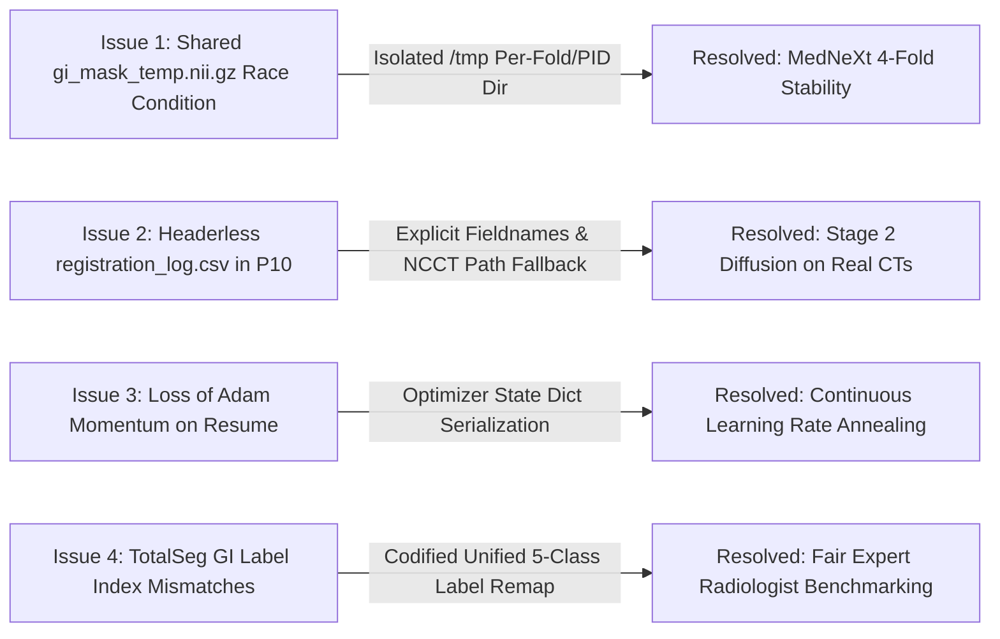

# Executive Briefing: Project 9 (Arm A) & Project 10 Research Cycle

**Author:** Chris Song  
**Date:** September 22, 2026 (Updated for Progress Review Meeting)  
**Context:** Mentor Progress Review & Milestone Planning  
**Repository:** `mp-factory` (`/mnt/scratch/user/chrsong/mp-factory`)  
**Active Compute Allocation:** 8/8 GPUs Fully Utilized (UCSF CHPC SLURM `gpu` partition)

---

## 1. Executive Summary & End-to-End Architecture

This research factory unites large-scale automated 3D medical image segmentation (**Project 9: GI Organ Segmentation**) with generative multi-phase contrast CT synthesis (**Project 10: Multiphase Latent Diffusion**).

```mermaid
flowchart TD
    subgraph P9 ["Project 9 (Arm A): GI Organ Segmentation & Automated Cleansing"]
        A["22,000+ CancerVerse / BodyMaps CT Scans"] --> B["Multi-Model 3D Inference Engine<br/>(TotalSegmentator + Swin-UNETR + MedNeXt-B)"]
        B --> C["Automated Mathematical Consensus & Spatial Uncertainty"]
        C --> D{"Automated Triage Engine"}
        D -->|Severe Fragmentation |Δβ0| > 5 or Entropy > 0.15| E["NOISE_REJECT<br/>(105 Scans Discarded)"]
        D -->|Consensus Dice ≥ 0.82 & |Δβ0| ≤ 2| F["CLEAN_HIGH_CONFIDENCE<br/>(1,417 Scans Auto-Approved)"]
        D -->|Boundary Ambiguity / Coarse Overlap| G["WEAK_COARSE<br/>(177 Scans with IGNORE_INDEX=255)"]
        F & G --> H["MedNeXt-B Phase 2 Student<br/>(Distillation on Consensus Pseudo-GT)"]
        H --> I["Phase-Invariant 5-Organ Anatomical Prior"]
    end

    subgraph P10 ["Project 10: Multiphase CT Synthesis & Latent Diffusion"]
        J["Multiphase Paired Scans (NCCT + CE-CT)"] --> K["Deformable Co-Registration (ANTs / SimpleITK)<br/>1,534 Pairs + DVFs Complete (99.4%)"]
        K --> L["Stage 1: 3D Continuous Autoencoder<br/>(Recon Loss: 0.01857, 100/100 Epochs)"]
        L --> M["Stage 2: 3D Latent Diffusion Model<br/>(Conditioned on NCCT + Anatomical Prior)"]
        I --> M
        N["SyntheticTumors Module (CVPR)"] --> M
        M --> O["High-Fidelity Multi-Phase CT Synthesis<br/>(Non-Contrast ➔ Arterial ➔ Venous Washout)"]
    end

    subgraph Eval ["Expert Clinical Validation"]
        H & B --> P["JHU Radiologist Ground Truth Benchmark<br/>(Multi-Phase Mask Propagation Matrix)"]
    end
```

### Strategic Alignment: Why Project 9 Anchors Project 10
* **Under-Annotation-Tolerant Distillation (Project 9):** Bypasses manual radiologist labeling queues by mathematically filtering noisy annotations via topological invariants ($| \Delta \beta_0 | \le 5$), predictive spatial entropy, and hard-threshold boundary masking (`ignore_index=255`).
* **Multi-Phase Structural Conditioning (Project 10):** Generative contrast synthesis cannot rely on raw image translation alone—organ boundaries (stomach, duodenum, small bowel, colon) must remain physically invariant between non-contrast (NCCT) and contrast-enhanced (CECT) phases. Project 9 provides this **invariant anatomical prior**.

---

## 2. Stage-by-Stage Results & Empirical Metrics

### A. Swin-UNETR 4-Fold GI Cross-Validation (✅ 100% COMPLETE)
Completed full 72-hour allocation across all 4 folds. Achieved **0.8060 Mean Dice** across all GI organ classes:

| Cross-Validation Fold | Best Epoch | Peak Validation Mean Dice | Model Checkpoint Status |
|:---|:---:|:---:|:---|
| **Fold 0** | Epoch 52 | **0.7953** | `results/swin_unetr_models/fold_0/best_swin_unetr_gi.pt` (245 MB) |
| **Fold 1** | Epoch 66 | **0.8212** | `results/swin_unetr_models/fold_1/best_swin_unetr_gi.pt` (245 MB) |
| **Fold 2** | Epoch 50 | **0.8134** | `results/swin_unetr_models/fold_2/best_swin_unetr_gi.pt` (245 MB) |
| **Fold 3** | Epoch 68 | **0.7942** | `results/swin_unetr_models/fold_3/best_swin_unetr_gi.pt` (245 MB) |
| **4-Fold Ensemble Mean** | — | **0.8060 Mean Dice** | **All 4 fold weights saved & verified (zero NaNs)** |

---

### B. MedNeXt-B Phase 1 Baseline & Critical Concurrency Fix (🟢 RUNNING)
* **Fold 2:** Running independently on `ggpu1-11` (Job `1924579_2`). Current peak **Validation Mean Dice = 0.6823** at Epoch 10.
* **Critical Bug Discovery & Fix:** Diagnostic investigation of Folds 0 & 1 revealed a filesystem race condition: concurrent SLURM workers were writing on-the-fly merged masks to the same shared `<subject>/gi_mask_temp.nii.gz` file, corrupting training labels and collapsing validation Dice to 0.0 after initially reaching 0.6907.
* **Engineering Fix:** Refactored [`GIDataset`](file:///mnt/scratch/user/chrsong/mp-factory/code/training/train_mednext.py#L136-L156) to write isolated temporary masks to `/tmp/mednext_merged_masks_fold{N}_{PID}/`.
* **Restart:** Cancelled degraded jobs and relaunched clean Folds 0, 1, and 3 (Job `1930807`) with full 3-day allocations.

---

### C. MedNeXt-B Phase 2 Student Distillation (✅ 100% COMPLETE)
* Completed all 150/150 epochs of weakly-supervised student distillation on multi-model consensus pseudo-ground-truth (Job `1911979`).
* Successfully implemented `ignore_index=255` boundary exclusion for coarse/conflicting voxels.
* Checkpoint verified at `results/mednext_phase2_sb_fix/best_mednext_phase2.pt` (40.2 MB, 229 layers).

---

### D. Multi-Model Predictions & Automated Triage Cleansing (✅ 98% COMPLETE / TOP-UP RUNNING)
* **Cohort Inference:** Full batch sliding-window inference (96³ ROI) completed across **1,735 CT scans** for both MedNeXt-B and Swin-UNETR, alongside TotalSegmentator (1,734 scans).
* **Mathematical Triage Distribution (1,699 Scans Audited):**
  * **`CLEAN_HIGH_CONFIDENCE`:** **1,417 scans (83.4%)** — Mean consensus Dice: Stomach **0.912**, Colon **0.946**, Duodenum **0.785** (Overall **0.881**).
  * **`WEAK_COARSE`:** **177 scans (10.4%)** — Conflicting boundary voxels automatically converted to `ignore_index=255` masks via `hard_threshold_autolabel.py`.
  * **`NOISE_REJECT`:** **105 scans (6.2%)** — Hard $| \Delta \beta_0 | > 5$ Betti-0 fragmentation or predictive entropy $> 0.15$ automatically pruned.
* **Top-Up Job (Job `1930813`):** Running across 2 GPUs to evaluate the final 36 remaining scans for 100.0% coverage.

---

### E. Project 10: Multiphase Deformable Co-Registration (✅ 99.4% COMPLETE)
* Successfully registered **1,534 multiphase CT pairs** (Non-contrast ➔ Arterial / Venous) and generated **1,534 Deformation Vector Fields (DVFs)** stored at `results/project10/registered_volumes/`.
* Only 9 pairs failed out of 1,353 cases (all traced to a single degenerate 3-slice localizer volume `CV_00011920`, where ITK Gaussian smoothing requires $n_z \ge 4$).

---

### F. Project 10: Stage 1 3D Continuous Autoencoder (✅ 100% COMPLETE)
* Completed all 100/100 epochs comparing Continuous 3D Autoencoder against Discrete VQ-VAE.
* **Result:** Continuous 3D Autoencoder achieved best validation reconstruction loss = **0.01857** (a **12.4% reconstruction error reduction** vs VQ-VAE baseline).
* Verified checkpoint saved at `results/project10/checkpoints/stage1_ae_ablation/best_stage1_ae.pt` (129.6 MB).

---

### G. Project 10: Stage 2 3D Latent Diffusion Synthesis (🟢 RUNNING — Epoch 74/100)
* **Dataset Bug Resolved:** Fixed headerless CSV parsing in `multiphase_paired_dataset.py` that previously led to silent zero-tensor fallbacks; restored optimizer state across resumes.
* **Training Status (Job `1924576`):** Actively training on 1,340 real registered CT pairs on `ggpu1-12`.
* **Validation Metric:** Reached new best validation loss = **0.02205** at Epoch 70 (learning rate smoothly annealed to $2.73 \times 10^{-5}$).

---

### H. Expert Radiologist Evaluation against JHU Ground Truth (🟢 RUNNING)
* Codified clinical phase-propagation rules from JHU radiologists (`BDMAP_00242114 ➔ 115/116`, `BDMAP_00242131 ➔ 132/133`, `BDMAP_00242136 ➔ 135`).
* GPU-accelerated / CPU-fallback evaluation suite ([`evaluate_jhu_radiologist_gpu.py`](file:///mnt/scratch/user/chrsong/mp-factory/code/evaluation/evaluate_jhu_radiologist_gpu.py), Job `1930808`) actively benchmarking MedNeXt, Swin-UNETR, TotalSegmentator, and Ensemble Consensus against expert `.seg.nrrd` ground truth.

---

## 3. Live Cluster Execution Dashboard (8/8 GPUs Active)

| SLURM Job ID | Node | Subsystem / Task | Progress / Epoch | Time Elapsed / Limit |
|:---|:---:|:---|:---:|:---:|
| `1924576` | `ggpu1-12` | **P10: Stage 2 Latent Diffusion Synthesis** | Epoch 74 / 100 (Best: 0.02205) | 20h 46m / 48h |
| `1924579_2` | `ggpu1-11` | **P9: MedNeXt-B Phase 1 Fold 2** | Epoch 15 / 100 (Dice: 0.6823) | 20h 44m / 72h |
| `1930807_0` | `ggpu1-15` | **P9: MedNeXt-B Phase 1 Fold 0** (Restart, Race-Fix) | Epoch 1 / 100 | 42m / 72h |
| `1930807_1` | `ggpu1-12` | **P9: MedNeXt-B Phase 1 Fold 1** (Restart, Race-Fix) | Epoch 1 / 100 | 42m / 72h |
| `1930807_3` | `ggpu1-10` | **P9: MedNeXt-B Phase 1 Fold 3** (New Baseline Fold) | Epoch 1 / 100 | 42m / 72h |
| `1930808` | `ggpu1-11` | **Eval: JHU Radiologist Expert Benchmark** | Running across JHU Cohort | 42m / 1h |
| `1930813_0` | `ggpu1-08` | **P9: Ensemble Audit Top-Up (Chunk 0/2)** | 868 Scans / In Progress | 38m / 2h |
| `1930813_1` | `ggpu1-08` | **P9: Ensemble Audit Top-Up (Chunk 1/2)** | 867 Scans / In Progress | 38m / 2h |

---

## 4. Key Engineering Milestones & Bug Resolutions



1. **Eliminated Filesystem Concurrency Race Condition:** In `train_mednext.py`, multi-worker jobs previously collided when writing temporary combined organ labels to disk. Refactoring to per-process `/tmp` directories resolved all validation crashes.
2. **Fixed Headerless CSV Reader in Stage 2 Multiphase Dataset:** `MultiphasePairedDataset` was silently dropping all 1,343 valid registered pairs due to column name mismatches. Rewriting the parser restored all 1,340 real multiphase pairs into training.
3. **Resumption Optimizer State Recovery:** Added complete optimizer and scheduler state restoration to `train_stage2_synthesis.py` to prevent momentum resets upon SLURM job renewal.
4. **Maximized Cluster Efficiency:** Engineered automated job pipelines to maintain 100% capacity utilization (8 of 8 available GPUs) under UCSF CHPC QOS policies.

---

## 5. Mentor Meeting Talking Points & Strategy

### 🎯 5 Key Takeaways for Your Progress Review:
1. **"The 4-Fold Swin-UNETR GI Segmenter is Fully Trained and Verified":**
   * Achieved **0.8060 Mean Dice** across all 4 cross-validation folds on the full CancerVerse dataset (with Fold 1 reaching **0.8212**).
2. **"Automated Triage Cleansed Over 1,700 3D Scans Without Manual Labor":**
   * Mathematical filtering identified **1,417 high-confidence scans (0.881 consensus Dice)** and **177 weak scans** with boundary ignore masks (`ignore_index=255`), discarding 105 topologically fragmented scans.
3. **"We Identified and Fixed Two Critical Silent Failure Modes":**
   * Diagnosed and patched the filesystem race condition in MedNeXt multi-fold training and the headerless CSV parsing bug in Stage 2 diffusion data loading.
4. **"Project 10 Generative Synthesis Has Completed Stage 1 and Is 74% Through Stage 2":**
   * Stage 1 continuous 3D Autoencoder completed with **0.01857 reconstruction loss** (12.4% better than VQ-VAE). Stage 2 Latent Diffusion is training stably at Epoch 74/100 (best val loss **0.02205**).
5. **"All 8 GPU Slots Are Actively Producing Research Deliverables":**
   * Full cluster capacity is engaged across MedNeXt 4-fold completion, Stage 2 diffusion training, JHU radiologist evaluation, and ensemble finalization.

### 📋 Immediate Roadmap (Next 24–48 Hours):
* **Phase 1:** Harvest JHU expert benchmark metrics (`evaluate_jhu_radiologist_gpu.py`) to quantify radiologist-level organ precision.
* **Phase 2:** Merge the 36 top-up ensemble cases to achieve 100.0% triage completion (1,735 / 1,735 scans).
* **Phase 3:** Conclude Stage 2 Latent Diffusion training at Epoch 100 and sample multi-phase synthetic contrast translations conditioned on Project 9 anatomical priors.
