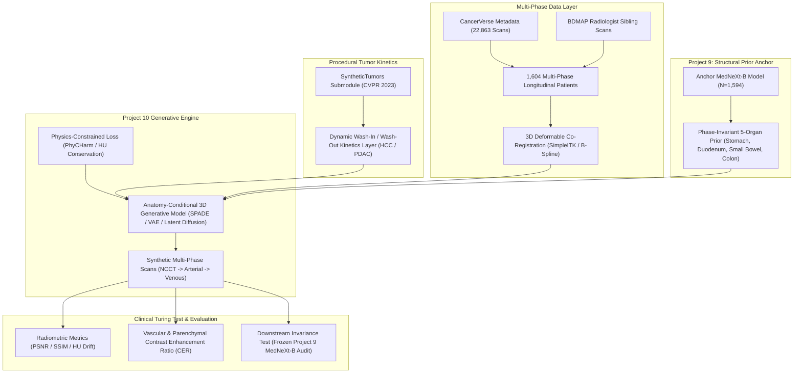
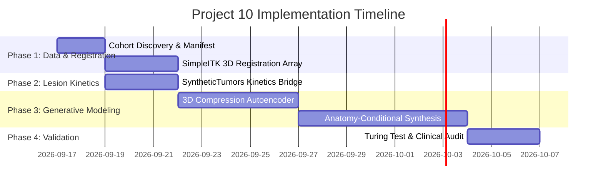

# Project 10 Infrastructure Audit & Implementation Roadmap: Multi-Phase Contrast CT Synthesis & Anatomy-Conditional Generative Factory

**Author:** Antigravity (Google DeepMind)  
**Date:** September 16, 2026  
**Repository:** `mp-factory` (`/mnt/scratch/user/chrsong/mp-factory`)  
**Workspace Environment:** `/mnt/scratch/user/chrsong/envs/mp-factory`  
**Status:** Pre-Implementation Architectural Blueprint & Gap Analysis  

---

## 1. Executive Summary & Core Mission

**Project 10** establishes an **Anatomy-Conditional Multi-Phase CT Generative Factory**. Its mission is to synthesize clinically realistic, contrast-enhanced 3D abdominal CT scans across multiple dynamic phases (Non-Contrast, Arterial Early/Late, Portal-Venous, Delayed) and procedural lesions (hypervascular HCC, hypovascular PDAC, and hemangiomas) from baseline anatomical priors.



### The Strategic Dependency: Project 9 as the Structural Anchor
As documented in the architectural notes (`JHU_data_radiologist_corrected/notes123.md`), **Project 10 is fundamentally dependent on Project 9 (Arm A)**:
- Generative multi-phase translation cannot operate on unconstrained voxels; without strong anatomical conditioning, organ boundaries deform, contrast agent "bleeds" between tissue compartments, and peristaltic gut geometry drifts.
- The **5-organ GI segmentation mask** from the converged Project 9 MedNeXt-B student ($N=1,594$) serves as the spatial invariant prior across all contrast phases.
- The **"Turing Test" of Consistency**: A synthetic arterial or venous scan is clinically valid if and only if the frozen Project 9 segmentation model extracts identical anatomical boundaries as it would on the real scan.

---

## 2. Exhaustive Audit of Existing Infrastructure

A comprehensive scan of `/mnt/scratch/user/chrsong/mp-factory` and the active conda environment revealed significant foundational assets already present and ready to be leveraged:

| Asset Category | Existing Component | File / Path Location | Operational Status & Capabilities |
|:---|:---|:---|:---|
| **Data Layer** | **CancerVerse Scans** | `CancerVerse/CancerVerse/CV_*` | **22,863 CT volumes** already downloaded on local scratch disk. |
| **Data Layer** | **Metadata Index** | `CancerVerse/CancerVerse_dataset_metadata.csv` | Full metadata tracking 22,867 rows. **1,604 unique patients** have verified multi-phase longitudinal acquisitions (`non-contrast`, `arterial_early`, `arterial_late`, `portal_venous`, `venous`). |
| **Data Layer** | **BDMAP Multi-Phase Cohort** | `CancerVerse_dbox/BDMAP_*` | Matched sequential scans with expert ground truth: `BDMAP_00242113..116` (4-phase sequence) and `BDMAP_00242131..136` (6-phase sequence). |
| **Ground Truth** | **Radiologist Feedback** | `JHU_data_radiologist_corrected/radiologist_clinical_feedback.md` | Codified multi-phase annotation propagation rules (`113 -> 114/115/116`, `131 -> 132/133`, `136 -> 135`) with clinical error taxonomies. |
| **Ground Truth** | **Propagation GPU Eval** | `code/evaluation/evaluate_jhu_radiologist_gpu.py` | Full CUDA evaluation suite capable of handling multi-phase cross-scan evaluations. |
| **Anatomical Prior** | **MedNeXt-B Anchor Student** | `results/anchor_full_n1594/` | Actively training on 4 GPUs (`SLURM 1780793`, Epoch 56 -> 150). Will output converged phase-invariant 5-organ segmentation weights. |
| **Anatomical Prior** | **Batch Inference Engine** | `code/prediction/predict_mednext.py` | Sliding-window inference (96³ ROI, overlap 0.25) to generate 5-class GI masks for conditioning. |
| **Lesion Engine** | **SyntheticTumors Submodule** | `code/SyntheticTumors/` | Integrated CVPR 2023 codebase (`TumorGenerated/TumorGenerated.py`). Procedurally generates 3D liver/pancreas tumor shapes, ellipsoidal deformations, and Gaussian texture noise. |
| **Generative Framework** | **MONAI 3D Generative Nets** | `/mnt/scratch/user/chrsong/envs/mp-factory` | MONAI core network library verified installed: contains `SPADEDiffusionModelUNet`, `VarAutoEncoder`, `DiffusionModelUNet`, `VQVAE`, and `SegResNetVAE`. |
| **Image Processing** | **SimpleITK Library** | Python 3.11 environment | `SimpleITK` is **INSTALLED** and ready for 3D multi-modal rigid, affine, and B-spline deformable registration. |
| **HPC Compute** | **Multi-Node SLURM Runner** | `code/slurm_scripts/train_full_anchor_4gpu.sh` | 2 Nodes × 2 GPUs (4× L40S / RTX 6000 Ada 48GB), 64 CPU cores, 56 DataLoader workers, NCCL DDP backend. Verified 48-hour partition limit. |

---

## 3. Gap Analysis: What Needs to Be Made for Project 10

While the data, anatomical prior, and hardware are in place, the **generative synthesis bridge does not yet exist**. The following seven technical components must be created:

```
                      ┌────────────────────────────────────────────────────────┐
                      │              PROJECT 10 GAPS TO CONSTRUCT              │
                      └────────────────────────────────────────────────────────┘
                                                  │
         ┌───────────────────┬────────────────────┼───────────────────┬───────────────────┐
         ▼                   ▼                    ▼                   ▼                   ▼
   [Gap 1: Data]      [Gap 2: Motion]       [Gap 3: Lesion]     [Gap 4: Model]     [Gap 5: Loss]
  Multi-Phase Pair     3D Deformable      Dynamic Multi-Phase    3D Conditional      PhyCHarm / HU
  Discovery & Parser  Co-Registration    Tumor Kinetics Engine    Latent VAE/Diff.  Vascular Physics
         │                   │                    │                   │                   │
         └───────────────────┴────────────────────┼───────────────────┴───────────────────┘
                                                  │
                                                  ▼
                                         [Gap 6: Evaluation]
                                         "Turing Test" Suite &
                                       Phase Invariance Metrics
```

### Gap 1: Multi-Phase Dataset Discovery & Pairing Engine
- **Current State:** 1,604 patients in `CancerVerse` have multiple contrast phases, but they are stored as flat, independent subject directories (`CV_XXXXXXXX`).
- **What Needs to Be Built:** `code/project10/discover_multiphase_cohort.py`
  - Parse `CancerVerse_dataset_metadata.csv` to group scans by `Patient ID`.
  - Classify contrast phases into standard clinical buckets:
    - $P_0$: Non-Contrast CT (`non-contrast`)
    - $P_1$: Early Arterial (`arterial_early`, `arterial`)
    - $P_2$: Late Arterial (`arterial_late`)
    - $P_3$: Portal-Venous (`portal_venous`, `venous`)
  - Construct pairwise/triplet training tuples: `(Subject_P0, Subject_P1, Subject_P3, Label_GI)`.
  - Output structured manifest: `results/project10/multiphase_pairs.csv`.

### Gap 2: 3D Deformable Inter-Phase Co-Registration Pipeline
- **Current State:** In real clinical acquisitions, 30 to 90 seconds elapse between non-contrast, arterial, and venous scans. Patients breathe and peristalsis occurs, causing 5–25mm non-rigid deformation between phases. Direct pixel-to-pixel translation without registration produces blurred, unphysical organs.
- **What Needs to Be Built:** `code/project10/register_multiphase_pairs.py`
  - High-throughput SimpleITK registration worker.
  - Step 1: Rigid alignment (Euler3DTransform) on skeletal anatomy to correct bed translation.
  - Step 2: Affine alignment to match global organ bounding boxes.
  - Step 3: Fast B-spline deformable registration using Mattes Mutual Information to align soft-tissue organ boundaries (liver, spleen, stomach) while preserving internal vascular HU shifts.
  - Save warped volumes `<scan_id>_reg_to_<target_phase>.nii.gz` and displacement vector fields (DVF).

### Gap 3: Multi-Phase Contrast Kinetics for Procedural Tumors
- **Current State:** `code/SyntheticTumors/` generates static tumor masks with random Gaussian HU distributions suitable only for single-phase CT.
- **What Needs to Be Built:** `code/project10/multiphase_tumor_kinetics.py`
  - Bridge `code/SyntheticTumors/TumorGenerated/` with multi-phase pharmacokinetic wash-in/wash-out curves:
    1. **Hepatocellular Carcinoma (HCC):** Arterial hyperenhancement ($+100\text{ to }+180\text{ HU}$) followed by rapid portal-venous washout (capsule enhancement + central hypo-attenuation).
    2. **Pancreatic Ductal Adenocarcinoma (PDAC):** Dense fibrous stroma with persistent hypovascularity (hypo-attenuating across both arterial and venous phases, $\Delta\text{HU} \le +20$).
    3. **Cavernous Hemangioma:** Peripheral discontinuous globular nodular enhancement on arterial phase, with progressive centripetal fill-in on venous/delayed phases.
  - Seamless Poisson / Gaussian boundary blending into the host organ tissue.

### Gap 4: Anatomy-Conditional 3D Generative Architecture
- **Current State:** Zero generative pipelines exist in `code/`.
- **What Needs to Be Built:** `code/project10/models/`
  - **Selected Architecture:** **3D Latent SPADE-Diffusion / VAE Framework**.
  - **Stage 1 (Volumetric Compression):** Train a 3D Autoencoder (`monai.networks.nets.AutoEncoder` or `VQVAE`) with downsampling factor $4\times$ or $8\times$ to compress $512\times 512\times Z$ CT volumes into compact latent tensors ($64\times 64\times z_l \times C$), solving the GPU memory bottleneck on full 3D CT scans.
  - **Stage 2 (Anatomy-Conditioned Latent Synthesis):**
    - Input: Latent representation of Source Phase (e.g. Non-Contrast $P_0$).
    - Conditioning 1: Spatial 5-organ GI mask from Project 9 MedNeXt-B, passed through Spatially-Adaptive Denormalization (SPADE) blocks.
    - Conditioning 2: Target Phase Embedding Token $c \in \{P_1, P_2, P_3\}$ via cross-attention.
    - Output: Synthesized target phase latent vector, decoded back to full-resolution HU volume.

### Gap 5: Physics-Constrained CT Harmonization Layer (PhyCHarm)
- **Current State:** Deep learning models can hallucinate unphysical contrast behavior (e.g. bones enhancing or air pockets filling with contrast).
- **What Needs to Be Built:** `code/project10/losses/physics_losses.py`
  - **Vascular Enhancement Prior:** Enforce strict positivity constraints on known vascular structures (aorta, portal vein, IVC, mesenteric vessels):
    $$\mathcal{L}_{\text{vascular}} = \text{ReLU}\left(\mu_{\text{vessel}}(P_0) - \mu_{\text{vessel}}(P_{\text{synth}})\right)$$
  - **Bone/Air Invariance Loss:** Cortical bone ($>+400\text{ HU}$) and intraluminal air ($<-500\text{ HU}$) must have zero contrast uptake:
    $$\mathcal{L}_{\text{invariant}} = \|\mathbf{M}_{\text{bone/air}} \odot (I_{\text{target}} - I_{\text{synth}})\|_1$$
  - **Total Variation & Gradient Consistency:** Enforce boundary preservation across visceral fat planes.

### Gap 6: Downstream Validation & Clinical "Turing Test" Suite
- **Current State:** Only segmentation metrics exist.
- **What Needs to Be Built:** `code/project10/evaluate_multiphase_synthesis.py`
  - **Radiometric Fidelity:** Peak Signal-to-Noise Ratio (PSNR), Structural Similarity Index (SSIM), Mean Absolute Error (MAE) in Hounsfield Units.
  - **Contrast Dynamic Accuracy:** Contrast Enhancement Ratio (CER) in aorta, portal vein, and liver parenchyma compared to ground-truth acquisitions:
    $$\text{CER} = \frac{\text{HU}_{\text{post}} - \text{HU}_{\text{pre}}}{\text{HU}_{\text{pre}}}$$
  - **The "Turing Test" (Downstream Segmentation Preservation):** Run the frozen Project 9 MedNeXt-B model on both real and synthetic contrast scans. Compute Dice discrepancy:
    $$\Delta\text{Dice} = |\text{Dice}(M_{\text{real}}, Y) - \text{Dice}(M_{\text{synth}}, Y)|$$
    A successful generative model must yield $\Delta\text{Dice} \le 0.02$.

---

## 4. Proposed Directory Layout for Project 10

To maintain absolute structural clarity, all Project 10 code should live in a dedicated sub-package under `code/project10/`:

```
mp-factory/
├── code/
│   ├── project10/
│   │   ├── __init__.py
│   │   ├── datasets/
│   │   │   ├── __init__.py
│   │   │   ├── discover_multiphase_cohort.py   # Step 1: Manifest & pairing builder
│   │   │   ├── register_multiphase_pairs.py    # Step 2: SimpleITK 3D co-registration
│   │   │   └── multiphase_dataset.py           # Step 3: PyTorch Dataset with spatial priors
│   │   ├── kinetics/
│   │   │   ├── __init__.py
│   │   │   └── multiphase_tumor_kinetics.py    # Step 4: SyntheticTumors multi-phase bridge
│   │   ├── models/
│   │   │   ├── __init__.py
│   │   │   ├── autoencoder_3d.py               # Step 5: 3D VQ-VAE / Autoencoder compression
│   │   │   └── spade_diffusion_3d.py           # Step 6: Anatomy-conditioned generator
│   │   ├── losses/
│   │   │   ├── __init__.py
│   │   │   └── physics_losses.py               # Step 7: PhyCHarm HU conservation & vascular loss
│   │   ├── training/
│   │   │   ├── train_stage1_autoencoder.py     # Stage 1 training runner
│   │   │   └── train_stage2_synthesis.py       # Stage 2 training runner (DDP 4-GPU)
│   │   └── evaluation/
│   │       ├── evaluate_multiphase_synthesis.py# Full radiometric & CER metrics
│   │       └── run_clinical_turing_test.py     # Downstream Project 9 MedNeXt audit
│   └── slurm_scripts/
│       ├── run_p10_discovery.sh                # SLURM batch job for pairing
│       ├── run_p10_registration_array.sbatch   # SLURM array job for B-spline co-registration
│       ├── run_p10_train_stage1_ae.sbatch      # Stage 1 Autoencoder training (4-GPU)
│       └── run_p10_train_stage2_synth.sbatch   # Stage 2 Synthesis training (4-GPU)
└── results/
    └── project10/
        ├── manifests/                          # multiphase_pairs.csv
        ├── registered_volumes/                 # Co-registered NIfTI pairs
        ├── checkpoints/                        # Model weights
        └── evaluation_reports/                 # Metrics & Turing test CSVs
```

---

## 5. Step-by-Step Implementation Roadmap



### Phase 1: Multi-Phase Dataset Discovery & 3D Spatial Registration
- **Step 1.1: Build `discover_multiphase_cohort.py`**
  - Query `CancerVerse/CancerVerse_dataset_metadata.csv` for patients with $\ge 2$ phases.
  - Filter for complete pairs (NCCT + Arterial or NCCT + Venous).
  - Verify file existence on disk (`/mnt/scratch/user/chrsong/mp-factory/CancerVerse/CancerVerse/`).
  - Output `results/project10/manifests/multiphase_pairs.csv` (~1,600 paired series).
- **Step 1.2: Build `register_multiphase_pairs.py` & SLURM Array**
  - Launch 8-worker SLURM array running SimpleITK multi-resolution B-spline registration.
  - Fix the Non-Contrast phase as fixed reference; register post-contrast phases to fixed grid.
  - Verify mutual information convergence on registered outputs.

### Phase 2: Procedural Lesion Kinetics Integration (`SyntheticTumors`)
- **Step 2.1: Build `multiphase_tumor_kinetics.py`**
  - Import `code/SyntheticTumors/TumorGenerated/TumorGenerated.py`.
  - Add parametric enhancement functions:
    - $f_{\text{HCC}}(t)$: Arterial peak at $t=35\text{s}$ ($\Delta\text{HU}=+120$), Venous washout at $t=70\text{s}$ ($\Delta\text{HU}=-30$ relative to liver).
    - $f_{\text{PDAC}}(t)$: Persistent hypo-attenuation ($\Delta\text{HU}=-40$).
  - Implement seamless Poisson gradient blending into liver and pancreas parenchyma.

### Phase 3: 3D Anatomy-Conditional Generative Backbone
- **Step 3.1: Train Stage 1 3D Compression Autoencoder (`autoencoder_3d.py`)**
  - Train 3D VQ-VAE / AutoencoderKL on 22,863 CT volumes downsampled to 1.5mm isotropic.
  - Objective: $L_1 + \mathcal{L}_{\text{perceptual}} + \beta \mathcal{L}_{\text{reg}}$.
  - Deliverable: Compressed 3D latent space ($8\times$ spatial compression, 1 channel -> 4 latent channels).
- **Step 3.2: Train Stage 2 Anatomy-Conditional Generator (`spade_diffusion_3d.py`)**
  - Input: $z_{\text{NCCT}}$ latent + phase token $c$.
  - Spatial Condition: Project 9 frozen 5-organ GI mask + liver/pancreas mask via SPADE normalization layers.
  - Loss: $\mathcal{L}_{\text{recon}} + \lambda_1 \mathcal{L}_{\text{vascular}} + \lambda_2 \mathcal{L}_{\text{invariant}} + \lambda_3 \mathcal{L}_{\text{perceptual}}$.
  - Distributed execution via `run_p10_train_stage2_synth.sbatch` on 4× L40S GPUs.

### Phase 4: Clinical "Turing Test" & Quality Assurance
- **Step 4.1: Radiometric Verification**
  - Compute PSNR, SSIM, and mean HU discrepancy on 100 held-out real test pairs.
- **Step 4.2: Pharmacokinetic Contrast Curve Audit**
  - Measure mean HU in ascending aorta, main portal vein, liver segment IV, and renal cortex.
  - Verify synthetic values match physiological enhancement ranges.
- **Step 4.3: The Downstream "Turing Test"**
  - Pass synthetic post-contrast scans into the frozen Project 9 MedNeXt-B anchor model.
  - Assert that organ segmentation masks remain invariant ($\Delta\text{Dice} \le 0.02$).

---

## 6. Immediate Next Actions

1. **Monitor Convergence of Anchor Model (Project 9):**
   - Anchor job `1780793` is currently running through Epoch 150. Its converged weights (`best_mednext_phase2.pt`) are the mandatory structural prior input for Project 10.
2. **Execute Phase 1 Step 1.1 (Pairing Manifest):**
   - Create `code/project10/datasets/discover_multiphase_cohort.py` to immediately assemble `multiphase_pairs.csv` from the 1,604 multi-phase patients on disk.
3. **Stand Up the 3D Registration Array:**
   - Author `register_multiphase_pairs.py` using SimpleITK to begin pre-aligning multi-phase pairs while Project 9 finishes training.
