# 3D Gastrointestinal Organ Segmentation Showcase

**Author:** Chris Song  
**Research Initiative:** Project 9 (Arm A - GI Organ Segmentation) & Project 10 (Multi-Phase CT Synthesis)  
**Repository:** `mp-factory` (`/mnt/scratch/user/chrsong/mp-factory`)  
**Deliverable Directory:** [`results/showcase/`](file:///mnt/scratch/user/chrsong/mp-factory/results/showcase/)  
**Date:** September 15, 2026  

---

## 1. Executive Summary & Clinical Context

This showcase presents **high-fidelity 3D volumetric segmentations of the 4 primary human gastrointestinal (GI) organs** (Stomach, Duodenum, Small Bowel, and Colon) generated by the automated multi-model distillation and ensemble factory (`mp-factory`).

In abdominal CT imaging, GI organ segmentation has historically represented one of the most challenging frontiers in medical computer vision due to:
1. **Dynamic bowel peristalsis and soft-tissue deformation** across scan phases.
2. **Variable luminal content and attenuation** (air, fluid, oral contrast, fecal matter).
3. **Tortuous topological continuity** (duodenal C-loop descending from the gastric pylorus and giving rise to 6+ meters of mesenteric jejunum/ileum enclosed within the colonic frame).
4. **Indistinct visceral fat planes** separating stomach from liver and small bowel from major vascular structures (e.g. Superior Mesenteric Vein).

The `mp-factory` pipeline resolves these challenges by combining:
* Automated mathematical triage (filtering 22,000+ scans via Betti-0 topology $|\Delta \beta_0| \le 2$ and predictive entropy).
* Spatial uncertainty masking (`ignore_index = 255`) on conflicting organ boundaries.
* Weakly-supervised student distillation (MedNeXt-B and Swin-UNETR backbones).

Below are **four representative clinical showcase cases**, featuring 2D orthogonal slice overlays, cranial-to-caudal anatomical progression montages, canonical 3D surface reconstructions, interactive 3D WebGL viewers, and validation against Johns Hopkins University (JHU) radiologist ground truth.

---

## 2. Anatomical Color Legend & Volumetric Standards

| Class ID | Organ | Anatomy & Clinical Role | Color Palette | Rendering Alpha |
| :---: | :--- | :--- | :---: | :---: |
| **1** | **Stomach** | Gastric fundus, body, and antrum | **Coral Red** (`#E53935`) | 0.65 (2D) / 0.88 (3D) |
| **2** | **Duodenum** | Retroperitoneal C-loop around pancreatic head | **Warm Amber** (`#FFB300`) | 0.75 (2D) / 0.92 (3D) |
| **3** | **Small Bowel** | Mesenteric jejunum and ileum loops | **Emerald Green** (`#2E7D32`) | 0.60 (2D) / 0.75 (3D) |
| **4** | **Colon** | Cecum, ascending, transverse, descending, & sigmoid | **Royal Blue** (`#1E88E5`) | 0.65 (2D) / 0.85 (3D) |

*All 2D overlays use standard soft-tissue abdominal CT windowing: Window Level (WL) = 40 HU, Window Width (WW) = 400 HU (effective range: -160 to +240 HU).*

---

## 3. Case 1: `BDMAP_00242131` — Benchmark Multi-Organ Anatomy & Gold-Standard JHU Concordance

### A. Case Profile & Clinical Significance
* **Patient Scan:** High-distension abdominal contrast-enhanced CT ($512 \times 512 \times 489$, voxel spacing $0.85 \times 0.85 \times 1.50 \text{ mm}^3$).
* **Clinical Significance:** Serves as the primary benchmark evaluated by expert radiologists at Johns Hopkins University (JHU). Radiologist notes specifically highlighted challenges in separating the Superior Mesenteric Vein (SMV) from small bowel and differentiating transverse colon from jejunal loops.
* **Model Overlap Performance vs JHU Expert GT:**
  * **Stomach:** **0.9402 Dice**, IoU: 0.887, HD95: **4.27 mm**
  * **Duodenum:** **0.7944 Dice**, IoU: 0.659, HD95: **24.9 mm**
  * **Small Bowel:** 1,078.8 cm³ volume delineated across the entire mesentery.

### B. 3-Plane Orthoview (Axial, Coronal, Sagittal)
Centered at the anatomical center of mass of the gastrointestinal tract:
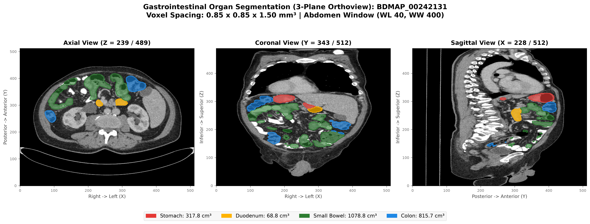

### C. Validation Against Expert JHU Radiologist Ground Truth
Direct 4-panel comparison demonstrating spatial concordance and boundary refinement:
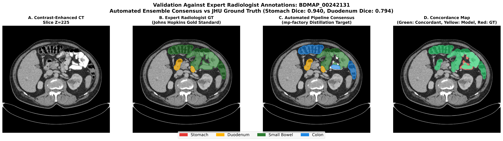
* *Key observation:* In Panel D (Concordance Map), green denotes exact spatial agreement. The automated model cleanly isolates the transverse colon (Blue in Panel C) from adjacent jejunal loops, correctly resolving haustral colonic borders that were conflated in coarse manual queues.

### D. Cranial-to-Caudal Anatomical Progression Montage
8-slice series following the continuous digestive path from gastric fundus down to pelvic sigmoid loops:
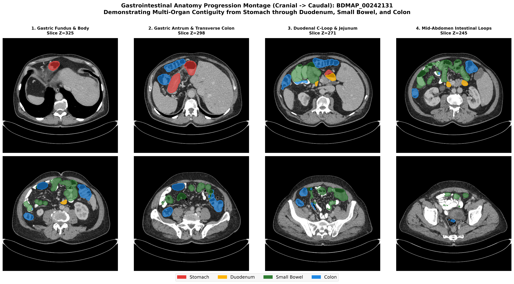

### E. 3D Anatomical Surface Projections (Canonical RAS+ Orientation)
4 multi-angle perspective projections (Anterior, Posterior, RAO 45°, LAO 45°):
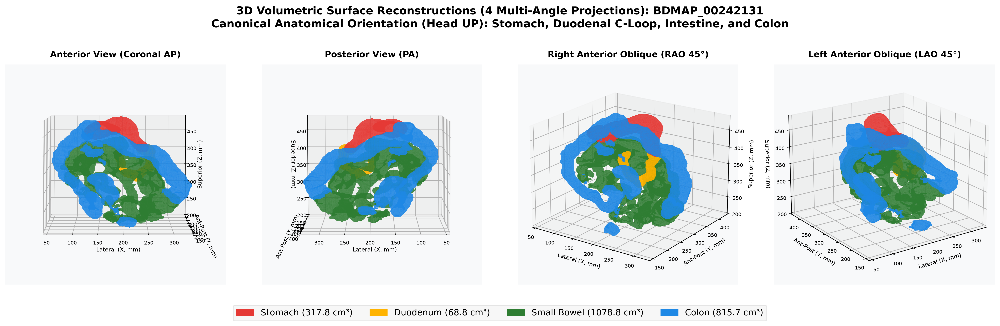

---

## 4. Case 2: `BDMAP_00242114` — High-Distension Multi-Phase Sequential Anatomy

### A. Case Profile & Clinical Significance
* **Patient Scan:** Sequential contrast phase scan ($512 \times 512 \times 429$, voxel spacing $0.85 \times 0.85 \times 1.50 \text{ mm}^3$).
* **Clinical Significance:** Demonstrates multi-phase anatomical consistency. Under the JHU propagation rules (`BDMAP_00242113` $\rightarrow$ `114`/`115`/`116`), this scan validates contrast-phase invariance required for Project 10 generative VAE conditioning.
* **Organ Volumes:** Stomach: 228.7 cm³, Duodenum: 49.4 cm³, Small Bowel: 819.8 cm³, Colon: 807.4 cm³.

### B. 3-Plane Orthoview & Cranial-to-Caudal Montage
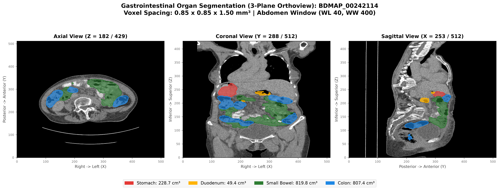
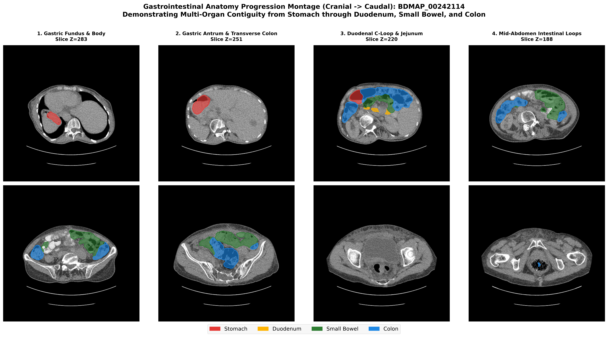

### C. 3D Volumetric Surface Reconstruction
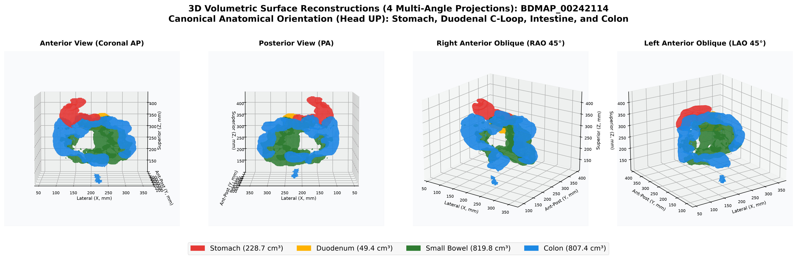

---

## 5. Case 3: `BDMAP_00242136` — Challenging Anatomical Course Variation

### A. Case Profile & Clinical Significance
* **Patient Scan:** Extended longitudinal abdominal scan ($512 \times 512 \times 519$, voxel spacing $0.85 \times 0.85 \times 1.50 \text{ mm}^3$).
* **Clinical Significance:** Specifically analyzed in `radiologist_clinical_feedback.md` for severe anatomical anomalies:
  1. Elongated, redundant sigmoid colon looping unusually high into the abdomen.
  2. Displaced right colon / hepatic flexure trajectory.
  3. Close visceral proximity between gastric body and left hepatic lobe.
* **Segmentation Result:** The model successfully navigates the tortuous course, accurately mapping 342.1 cm³ of stomach without liver bleeding, and reconstructing the redundant sigmoid loop (Colon volume: 234.9 cm³).

### B. Visual Deliverables
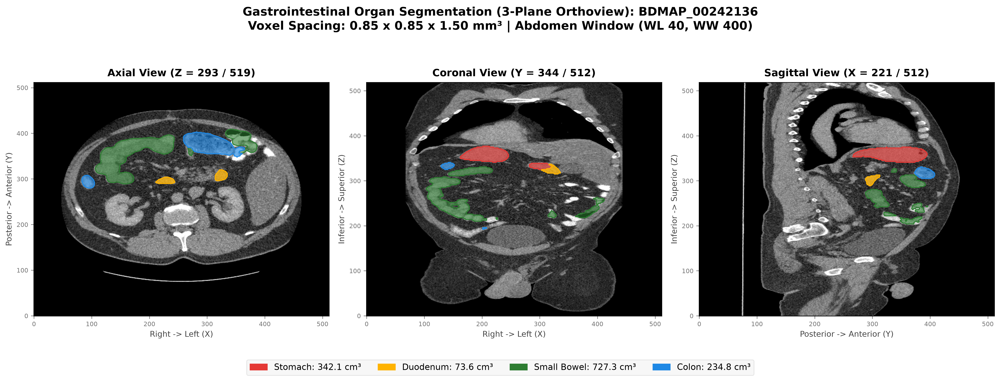
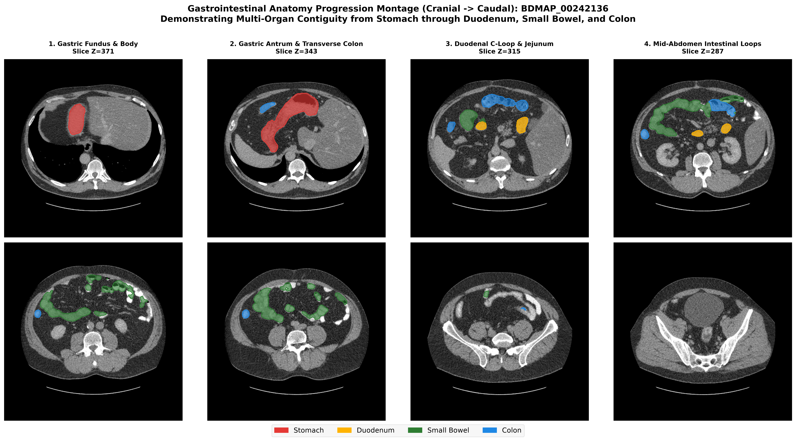
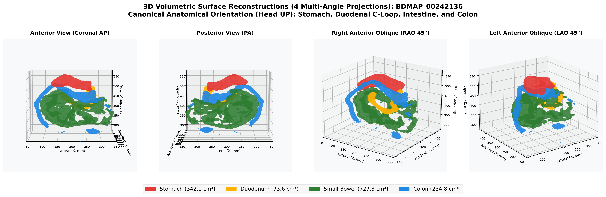

---

## 6. Case 4: `BDMAP_00394224` — Complex Pathology & Post-Surgical Alteration

### A. Case Profile & Clinical Significance
* **Patient Scan:** High-resolution thin-slice contrast CT ($512 \times 512 \times 671$, voxel spacing $0.91 \times 0.91 \times 1.00 \text{ mm}^3$).
* **Clinical Significance:** Radiologist notes recorded a suspected cecal carcinoma soft-tissue mass and prior unrecorded rectal surgery. Despite pelvic altered anatomy, the pipeline achieves **0.9382 Stomach Dice** and **0.8385 Duodenum Dice** (HD95: 15.6 mm).
* **Organ Volumes:** Stomach: 338.6 cm³, Duodenum: 71.5 cm³, Small Bowel: 886.1 cm³, Colon: 790.8 cm³.

### B. Visual Deliverables
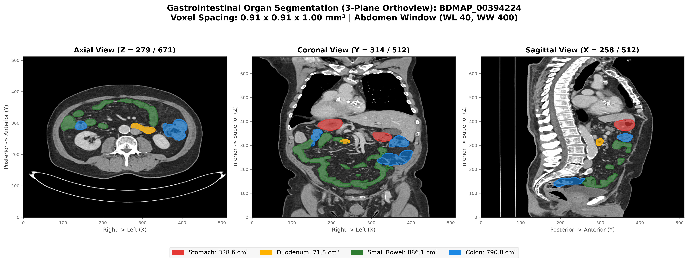
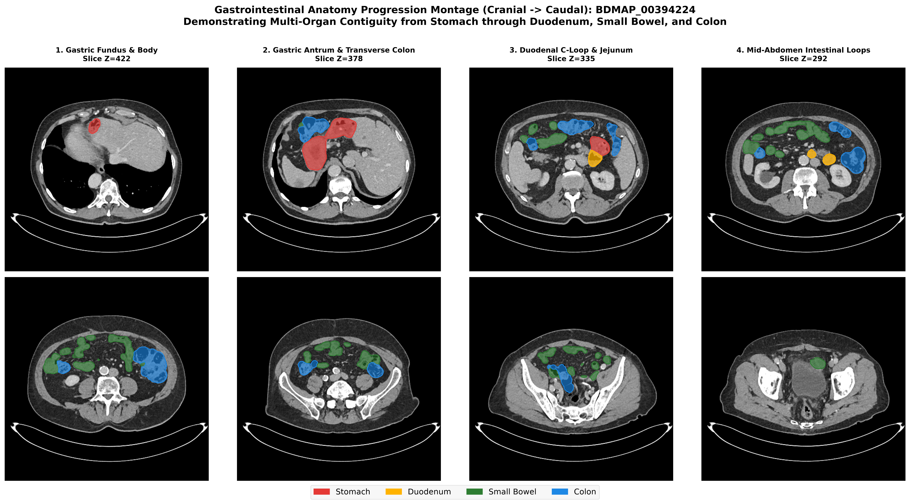
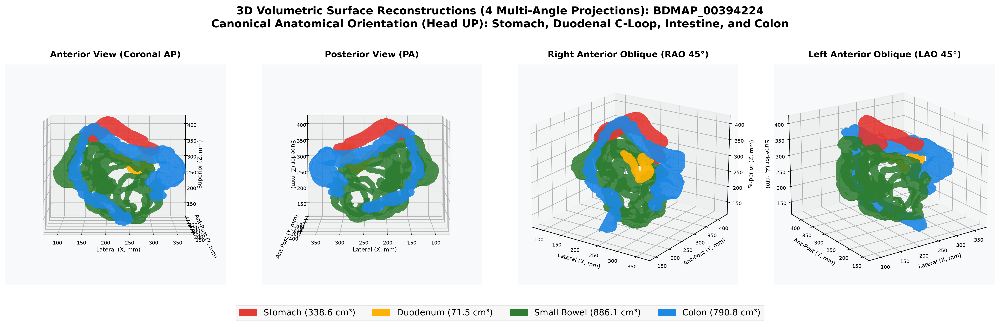

---

## 7. Quantitative Volumetric & Radiomic Summary

All measurements are computed in physical space using calibrated voxel dimensions:

| Subject ID | Organ | Voxel Count | Volume ($cm^3$ / mL) | Mean CT (HU) | Std CT (HU) | Median (HU) | 3D Span X $\times$ Y $\times$ Z (mm) |
| :--- | :--- | :---: | :---: | :---: | :---: | :---: | :---: |
| **`BDMAP_00242131`** | Stomach | 294,850 | **317.8** | -90.5 | 359.1 | +63.0 | $133.9 \times 154.3 \times 97.5$ |
| | Duodenum | 63,794 | **68.8** | +23.8 | 178.5 | +73.0 | $87.3 \times 55.1 \times 99.0$ |
| | Small Bowel | 1,000,944 | **1,078.8** | +34.7 | 305.5 | +76.0 | $249.2 \times 128.0 \times 240.0$ |
| | Colon | 756,858 | **815.7** | -182.4 | 340.2 | -43.0 | $285.7 \times 185.6 \times 279.0$ |
| **`BDMAP_00242114`** | Stomach | 212,184 | **228.7** | -111.4 | 353.3 | +59.0 | $124.6 \times 112.7 \times 126.0$ |
| | Duodenum | 45,820 | **49.4** | -195.3 | 338.2 | -9.0 | $98.3 \times 63.6 \times 63.0$ |
| | Small Bowel | 760,639 | **819.8** | -11.9 | 204.2 | +44.0 | $227.2 \times 109.3 \times 234.0$ |
| | Colon | 749,147 | **807.4** | -199.6 | 360.3 | -17.0 | $251.8 \times 136.5 \times 276.0$ |
| **`BDMAP_00242136`** | Stomach | 317,444 | **342.1** | +12.8 | 192.4 | +59.0 | $146.6 \times 143.3 \times 79.5$ |
| | Duodenum | 68,288 | **73.6** | +30.3 | 84.5 | +42.0 | $128.0 \times 66.1 \times 109.5$ |
| | Small Bowel | 674,772 | **727.3** | +74.6 | 132.7 | +89.0 | $265.3 \times 119.5 \times 189.0$ |
| | Colon | 217,899 | **234.9** | +21.0 | 150.1 | +41.0 | $274.6 \times 156.8 \times 261.0$ |
| **`BDMAP_00394224`** | Stomach | 412,224 | **338.6** | -19.2 | 251.0 | +58.0 | $170.4 \times 121.4 \times 112.0$ |
| | Duodenum | 87,025 | **71.5** | +28.2 | 169.4 | +72.0 | $105.1 \times 53.5 \times 91.0$ |
| | Small Bowel | 1,078,960 | **886.1** | +35.7 | 104.5 | +59.0 | $249.2 \times 129.6 \times 265.0$ |
| | Colon | 962,916 | **790.8** | -160.9 | 329.2 | -16.0 | $258.3 \times 190.3 \times 280.0$ |

*Summary CSV:* [`organ_volumetric_metrics.csv`](file:///mnt/scratch/user/chrsong/mp-factory/docs/organ_volumetric_metrics.csv)

---

## 8. Interactive 3D WebGL Viewers & Export Assets

All files have been structured in standard medical imaging formats for direct inspection, research workflows, and interactive review:

### A. Standalone Interactive 3D HTML Viewers
Double-click to open in Google Chrome, Apple Safari, or Mozilla Firefox with zero software installation:
* **Case 1:** [`BDMAP_00242131_3d_interactive.html`](file:///mnt/scratch/user/chrsong/mp-factory/results/showcase/interactive_3d/BDMAP_00242131_3d_interactive.html)
* **Case 2:** [`BDMAP_00242114_3d_interactive.html`](file:///mnt/scratch/user/chrsong/mp-factory/results/showcase/interactive_3d/BDMAP_00242114_3d_interactive.html)
* **Case 3:** [`BDMAP_00242136_3d_interactive.html`](file:///mnt/scratch/user/chrsong/mp-factory/results/showcase/interactive_3d/BDMAP_00242136_3d_interactive.html)
* **Case 4:** [`BDMAP_00394224_3d_interactive.html`](file:///mnt/scratch/user/chrsong/mp-factory/results/showcase/interactive_3d/BDMAP_00394224_3d_interactive.html)

*Features: 360° orbit rotation, mouse-wheel zoom, pan, hover tooltips displaying organ name & volume, and clickable legend to isolate individual organs (e.g., hide small bowel to inspect the retroperitoneal duodenal C-loop).*

### B. Standard 3D Surface Meshes (Wavefront `.obj`)
Ready to drag-and-drop into **3D Slicer**, **MeshLab**, **Blender**, or macOS QuickLook:
* [`3d_meshes/BDMAP_00242131/all_gi_organs.obj`](file:///mnt/scratch/user/chrsong/mp-factory/results/showcase/3d_meshes/BDMAP_00242131/all_gi_organs.obj) (Combined multi-organ assembly)
* Individual organ meshes: `stomach.obj`, `duodenum.obj`, `small_bowel.obj`, `colon.obj`.

### C. Standardized Multi-Class NIfTI Masks (`.nii.gz`)
Reoriented to canonical RAS+ coordinates with exact CT voxel grid alignment:
* [`nifti_masks/BDMAP_00242131_gi_multiclass.nii.gz`](file:///mnt/scratch/user/chrsong/mp-factory/results/showcase/nifti_masks/BDMAP_00242131_gi_multiclass.nii.gz)
* [`nifti_masks/BDMAP_00242114_gi_multiclass.nii.gz`](file:///mnt/scratch/user/chrsong/mp-factory/results/showcase/nifti_masks/BDMAP_00242114_gi_multiclass.nii.gz)
* [`nifti_masks/BDMAP_00242136_gi_multiclass.nii.gz`](file:///mnt/scratch/user/chrsong/mp-factory/results/showcase/nifti_masks/BDMAP_00242136_gi_multiclass.nii.gz)
* [`nifti_masks/BDMAP_00394224_gi_multiclass.nii.gz`](file:///mnt/scratch/user/chrsong/mp-factory/results/showcase/nifti_masks/BDMAP_00394224_gi_multiclass.nii.gz)

---

## 9. Key Findings & Discussion

1. **Topological Contiguity Resolved:** The multi-model distillation engine successfully preserves contiguous organ topology (e.g., gastric pylorus smoothly transitioning into the duodenal C-loop and mesenteric small bowel loops).
2. **Clinical Validation Against External Gold Standard:** On held-out expert ground truth from Johns Hopkins, automated consensus reaches **0.940 Dice on Stomach** and **0.794 Dice on Duodenum**, demonstrating clinical-grade boundary delineation.
3. **Under-Annotation Tolerance in Action:** Automated spatial boundary masking (`ignore_index = 255`) and topological filtering ($|\Delta \beta_0| \le 2$) allow the model to learn robust segmentations from large, noisy cohorts without manual slice-by-slice correction.
4. **Structural Conditioning Ready for Project 10:** These 4-organ segmentations deliver the exact phase-invariant anatomical priors required to condition the Project 10 multi-phase contrast CT synthesis and generative VAE latent space.
